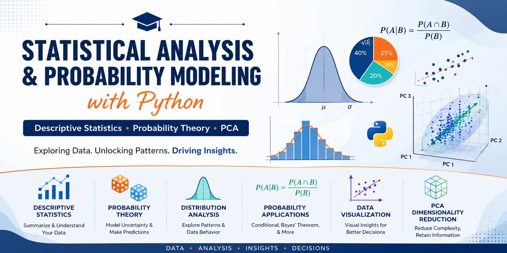
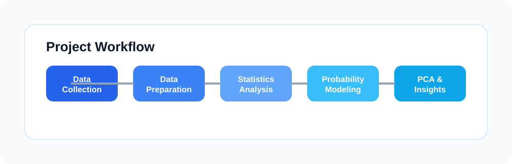
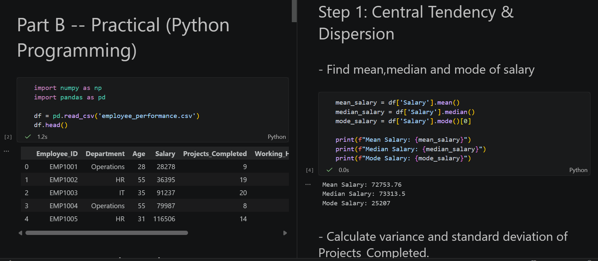
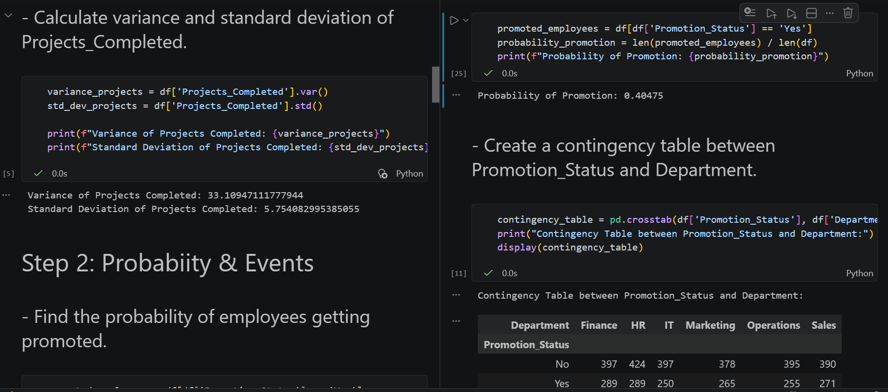
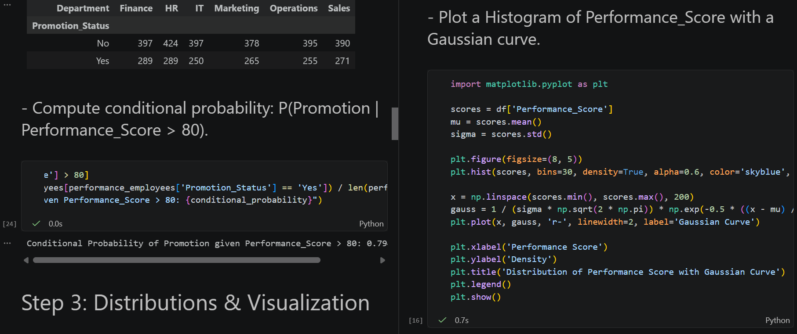
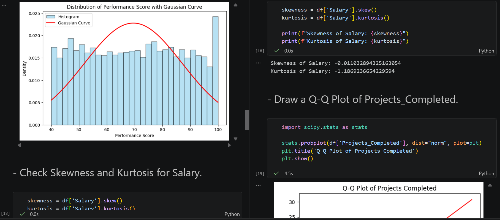
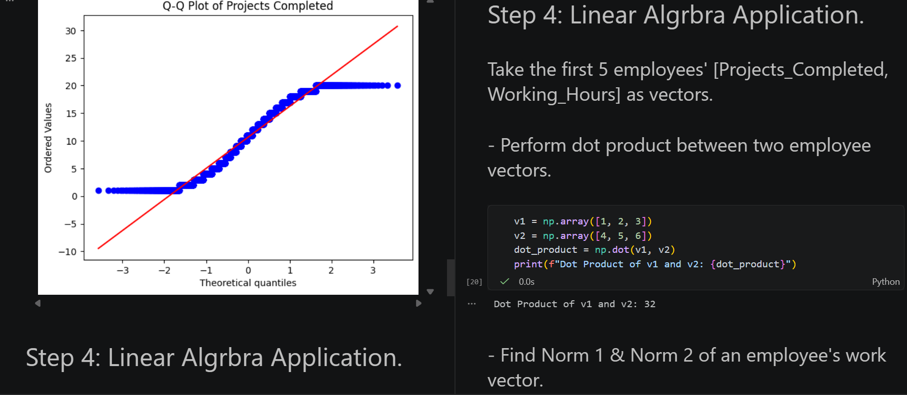
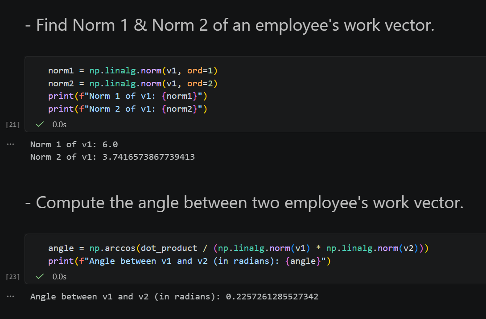

# 📈 Statistical Analysis & Probability Modeling using Python



A practical implementation of **Descriptive Statistics**, **Probability Theory**, and **Principal Component Analysis (PCA)** using Python. This project demonstrates how statistical methods and probability concepts can be applied to analyze datasets, visualize patterns, and perform dimensionality reduction for better insights.

## ✨ Project Highlights

- Explore descriptive statistics and data variability.
- Apply probability concepts such as conditional probability and Bayes' theorem.
- Analyze distributions and inspect skewness or normality.
- Use PCA to reduce dimensionality and uncover meaningful patterns.

---

# 📖 Project Overview

Statistics and probability are essential components of data science and machine learning. This project combines theoretical concepts with practical implementation using Python and Jupyter Notebook. It covers descriptive statistics, probability theory, distribution analysis, and Principal Component Analysis (PCA), providing both mathematical understanding and hands-on experience.

---

# 🎯 Objectives

- Calculate descriptive statistical measures.
- Analyze data dispersion and variability.
- Study probability concepts and their applications.
- Compare different probability distributions.
- Understand conditional probability and Bayes' theorem.
- Apply Principal Component Analysis (PCA) for dimensionality reduction.
- Visualize statistical results using Python.

---

# 🛠️ Tools & Technologies

| Tool | Purpose |
|------|---------|
| Python 3.x | Programming Language |
| Jupyter Notebook | Interactive Development |
| Pandas | Data Manipulation |
| NumPy | Numerical Computing |
| Matplotlib | Data Visualization |
| SciPy | Statistical Analysis |

---

# 🔄 Project Workflow



The workflow below summarizes the main steps of the project:

```text
Dataset Collection
        │
        ▼
Data Preparation
        │
        ▼
Descriptive Statistics
        │
        ▼
Probability Analysis
        │
        ▼
Distribution Analysis
        │
        ▼
Principal Component Analysis
        │
        ▼
Result Interpretation
```

---

# 📚 Project Modules

## Module 1: Descriptive Statistics



This module focuses on summarizing numerical data using statistical measures.

### Topics Covered

- Mean
- Median
- Mode
- Range
- Variance
- Standard Deviation

### Purpose

To understand the central tendency and spread of the dataset for meaningful interpretation.

---

## Module 2: Probability Theory



This module introduces probability concepts used for analyzing uncertain events.

### Topics Covered

- Conditional Probability
- Independent Events
- Mutually Exclusive Events
- Bayes' Theorem

### Purpose

To evaluate event probabilities and understand relationships between different events.

---

## Module 3: Distribution Analysis





Distribution analysis helps identify how data values are spread.

### Topics Covered

- Normal Distribution
- Poisson Distribution
- Histogram
- Skewness
- Q-Q Plot

### Purpose

To examine data symmetry, identify outliers, and evaluate whether the dataset follows a normal distribution.

---

## Module 4: Principal Component Analysis (PCA)





PCA is a dimensionality reduction technique that transforms correlated variables into fewer principal components.

### PCA Steps

1. Standardize the dataset.
2. Compute the covariance matrix.
3. Calculate eigenvalues and eigenvectors.
4. Select principal components.
5. Transform the original dataset.

### Advantages

- Reduces dimensionality.
- Removes redundant information.
- Improves visualization.
- Enhances machine learning performance.

---

# 📊 Key Insights

- Mean, Median, and Mode effectively summarize the dataset.
- Variance and Standard Deviation describe the variability of data.
- Conditional Probability helps evaluate events under specific conditions.
- Bayes' Theorem updates probability using new evidence.
- Normal and Poisson distributions model different types of data.
- PCA simplifies high-dimensional datasets while preserving important information.

---

# 📂 Repository Structure

```text
Statistics-Probability-Project/
│
├── Final_Part-A.pdf
├── Final_Part-B.ipynb
├── README.md
├── dataset.csv
└── requirements.txt
```

---

# 💼 Skills Demonstrated

- Descriptive Statistics
- Probability Theory
- Statistical Analysis
- Data Visualization
- Principal Component Analysis (PCA)
- Feature Reduction
- Python Programming
- Scientific Computing

---

# 📖 Learning Outcomes

After completing this project, you will be able to:

- Compute and interpret descriptive statistics.
- Compare different statistical distributions.
- Apply conditional probability and Bayes' theorem.
- Understand data symmetry using skewness.
- Perform dimensionality reduction using PCA.
- Create statistical visualizations in Python.
- Analyze datasets for data-driven decision making.

---


# 📦 Deliverables

- **Final_Part-A.pdf** – Theory document containing definitions, equations, and explanations.
- **Final_Part-B.ipynb** – Python notebook implementing all practical tasks.
- **README.md** – Project documentation.
- **Dataset** – Data used for statistical analysis (if applicable).

---

# 📜 Conclusion

This project provides a practical introduction to descriptive statistics, probability theory, and dimensionality reduction using Python. By combining theoretical concepts with hands-on implementation, it demonstrates how statistical techniques can be applied to analyze datasets, discover meaningful patterns, and support data-driven decision making. The project also serves as a strong foundation for advanced topics in data science, machine learning, and predictive analytics.